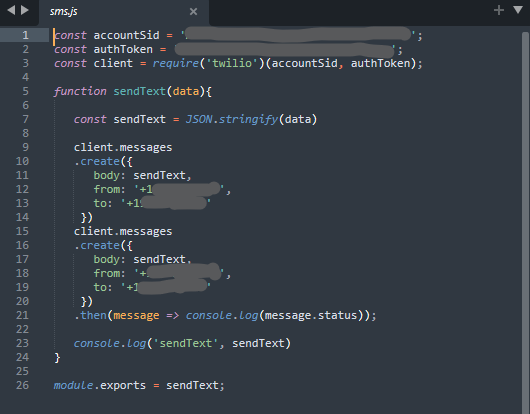

## Web Scrapper/Crawler 

Scrape your favorite djs and send a text to yourself or friends with twilio 

## installation

install dependncies with 

npm install 

run python3 in the root folder 

`python lib/scraper.py`

create a twilio/sms.js file with clientid api_key and phone numbers to send text after you'd created a twilio account. 

